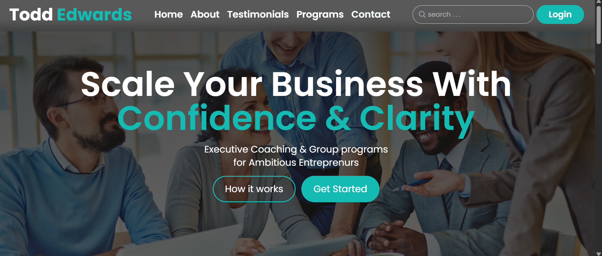
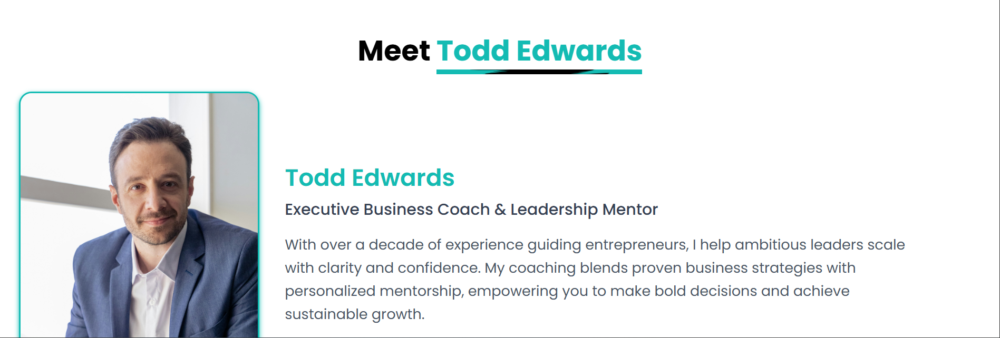
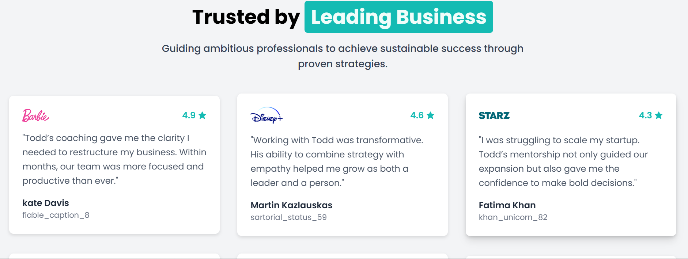
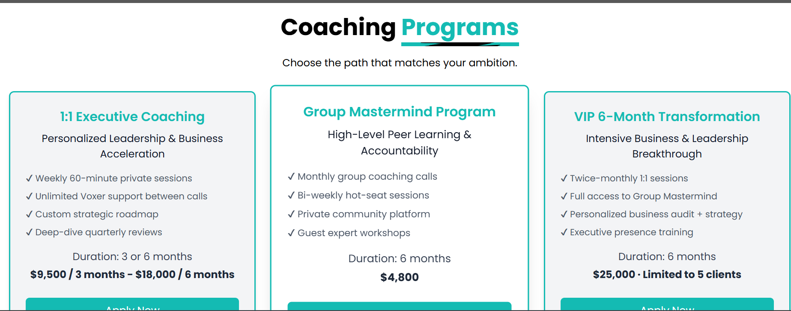
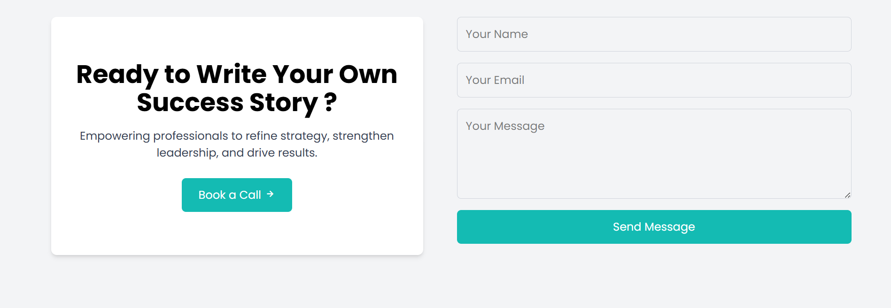
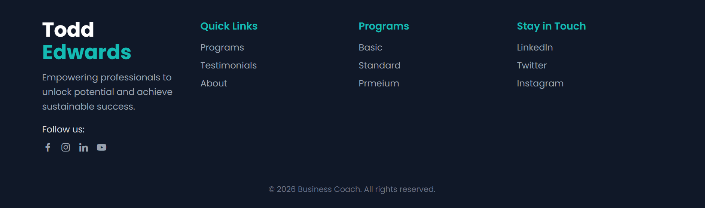

# business-coach-landing-page

A resposive and modern landing page designed for coaches and educators to showcase their personal brand, attract clients, and build credibility online.

---

## Features

- **Hero Section**: Clear headline, subtext, and call‑to‑action buttons (“How it Works”, “Get Started”).
- **About Section**: Professional introduction with portrait and background details.
- **Testimonials**: Trusted by leading businesses, featuring client reviews with ratings and brand logos.
- **Programs Section**: Comparison of coaching packages (Executive Coaching, Group Mastermind, VIP Transformation) with pricing and features.
- **Contact Section**: Call‑to‑action block and responsive contact form for inquiries or booking calls.
- **Footer**: Quick links, program tiers, social media icons, and copyright.

---

## Tech Stack

- **HTML5** — semantic structure
- **TailwindCSS (CLI build)** — responsive styling and brand accents
- **Vanilla JavaScript** — optional interactivity
- **Responsive Design** — optimized for mobile, tablet, and desktop
- **SEO‑friendly meta tags** — improved discoverability

## Getting Started

### 1. Clone the repository

```bash
git clone https://github.com/your-username/business-coach-landing-page.git
cd business-coach-landing-page
```

### 2. Install dependencies

```bash
npm install
```

### 3. Build Tailwind CSS

```bash
npx tailwindcss -i ./css/input.css -o ./css/output.css --watch
```

### 4. Run locally

Open index.html in your browser or deploy using GitHub Pages, Netlify, or Vercel.

---

## Deployment

- GitHub Pages → quick static hosting
- Netlify / Vercel → one‑click deployment with CI/CD integration

---

## screenshots








---

## Case Study

This landing page is part of my portfolio niche:helping coaches and educators with personal branding.
<br/>
It demonstarates how a professional landing page can:

- Highlight expertise
- Build trust with testimonials
- Provide clear call-to-action(CTA) for client acquisition
- present coaching programs in a structured, coversion-friendly layout

## License

This Project is licensed under the MIT License: free to use, modify, and distribute.

## Credits

- images: Unsplash Contributors (eg.,
  Photo by <a href="https://unsplash.com/@designerflix?utm_source=unsplash&utm_medium=referral&utm_content=creditCopyText">Acesso DesignerFlix</a> on <a href="https://unsplash.com/photos/a-man-in-a-blue-suit-sitting-in-a-chair-857QZOer6Ps?utm_source=unsplash&utm_medium=referral&utm_content=creditCopyText">Unsplash</a>)

- icons: Boxicons/TailwindCSS utilities

## Live Demo

- Live demo link: https://webwizsharmin.github.io/business-coach-landing-page/

## Connect

- GitHub: github.com/webwizsharmin
- LinkedIn: linkedin.com/in/webwizsharmin/
